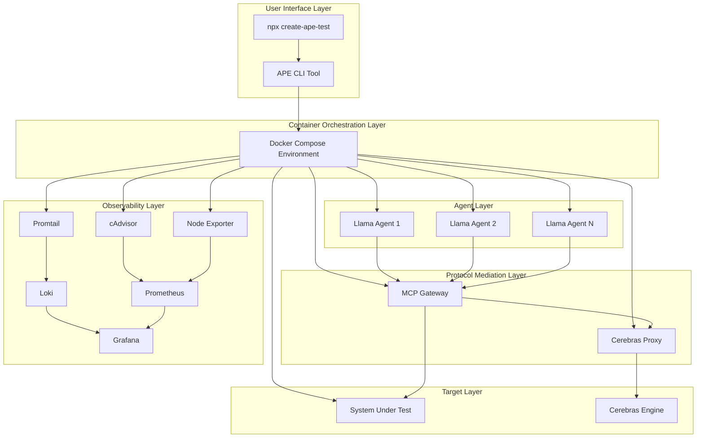

# Design Document

## Overview

The Agentic Protocol Engine (APE) is designed as a distributed, containerized system that leverages AI agents for intelligent load testing. The architecture employs a three-tier microservices design orchestrated by Docker Compose, with a focus on scalability, observability, and ease of use. The system combines high-speed LLM inference with standardized protocol mediation to generate realistic, stateful traffic patterns that traditional load testing tools cannot achieve.

The core innovation lies in the synergistic coupling of Cerebras Wafer Scale Engine's accelerated inference capabilities with the Model Context Protocol (MCP) Gateway's standardization, enabling unprecedented scale of intelligent traffic generation while maintaining sub-second cognitive latency for realistic user simulation.

## Architecture

### High-Level System Architecture



### Three-Tier Architecture Design

#### 1. Agent Layer
- **Containerized Llama Agents**: Stateless Docker containers running LlamaIndex-based agents
- **Horizontal Scaling**: Dynamic scaling via Docker Compose (`--scale llama_agent=N`)
- **Session Management**: In-memory context persistence for stateful behavior
- **Tool Integration**: Specialized tools for HTTP operations and state management

#### 2. Protocol Mediation Layer
- **MCP Gateway**: Central routing and protocol translation service
- **Cerebras Proxy**: Internal service endpoint for inference communication
- **Request Standardization**: Enforces MCP-compliant JSON schemas
- **Security Isolation**: Decouples agents from direct SUT access

#### 3. Target Layer
- **System Under Test (SUT)**: The application being load tested
- **Cerebras Inference Engine**: High-speed LLM inference for agent decision-making
- **External Dependencies**: Any additional services required by the SUT

## Components and Interfaces

### Llama Agent Component

**Technology Stack**: LlamaIndex CustomSimpleAgentWorker, Python, Docker

**Core Responsibilities**:
- Execute user journey goals through sequential decision-making
- Maintain session context across multi-step transactions
- Generate MCP-compliant tool calls with Pydantic validation
- Handle dynamic error recovery and alternate path selection

**Tool Interface Design**:

```python
class MCPToolCall(BaseModel):
    target_api_name: str  # Routing identifier for MCP Gateway
    http_method: str      # GET, POST, PUT, DELETE
    endpoint_path: str    # API endpoint path
    request_payload: Optional[dict] = None  # Request body data
    session_headers: Optional[dict] = None  # Authentication/session data

class AgentTools:
    def tool_http_get(self, api_name: str, path: str, headers: dict = None) -> MCPToolCall
    def tool_http_post(self, api_name: str, path: str, data: dict, headers: dict = None) -> MCPToolCall
    def tool_http_put(self, api_name: str, path: str, data: dict, headers: dict = None) -> MCPToolCall
    def tool_http_delete(self, api_name: str, path: str, headers: dict = None) -> MCPToolCall
    def tool_state_update(self, session_data: dict) -> None  # Internal context management for stateful sessions
```

**Agent Execution Loop**:
1. **Goal Assignment**: Initialize with specific user journey goal (e.g., "complete purchase flow")
2. **LLM Decision**: Use Cerebras Llama 4 Scout for sub-second inference with current session context
3. **Tool Execution**: Generate MCP-compliant request via validated tools with session headers
4. **Response Processing**: Extract session data (cookies, JWT tokens, transaction IDs) and update context
5. **State Persistence**: Use Tool_State_Update to record session details for next decision
6. **Adaptive Decision**: Analyze response codes and content to determine next action or recovery path
7. **Error Classification**: Categorize HTTP responses (2xx success, 4xx client errors, 5xx server errors) for metrics
8. **Loop Continuation**: Repeat until goal completion, failure, or maximum steps reached

**Design Rationale**: The execution loop emphasizes stateful session management (Requirement 7) and comprehensive error categorization (Requirement 8) to enable realistic multi-step user journeys with proper validation metrics.

### MCP Gateway Component

**Technology Stack**: Docker MCP Gateway, HTTP/JSON, Routing Configuration

**Core Responsibilities**:
- Route agent requests to appropriate target services
- Enforce request/response schema validation
- Provide service discovery and load balancing
- Maintain request/response logging for observability

**Routing Configuration Schema**:

```json
{
  "routes": {
    "sut_api": {
      "base_url": "http://sut_target:8080",
      "timeout": 30,
      "retry_policy": {
        "max_retries": 3,
        "backoff_factor": 1.5
      }
    },
    "cerebras_api": {
      "base_url": "http://cerebras_proxy:8000",
      "timeout": 10,
      "auth_headers": {
        "Authorization": "Bearer ${CEREBRAS_API_KEY}"
      }
    }
  }
}
```

**Request Processing Flow**:
1. **Request Validation**: Validate incoming MCP schema compliance
2. **Route Resolution**: Map `api_name` to target service configuration
3. **Header Injection**: Add authentication and tracing headers
4. **Request Forwarding**: Execute HTTP request to target service
5. **Response Processing**: Log response and return to agent
6. **Error Handling**: Implement retry logic and error response formatting

### Cerebras Proxy Component

**Technology Stack**: FastAPI, OpenAI-compatible API, Docker

**Core Responsibilities**:
- Provide OpenAI-compatible interface to Cerebras Llama 4 Scout
- Handle authentication and rate limiting
- Implement request/response logging for performance metrics
- Manage connection pooling and error handling

**API Interface**:

```python
@app.post("/v1/chat/completions")
async def chat_completions(request: ChatCompletionRequest):
    # Forward to Cerebras endpoint with performance tracking
    start_time = time.time()
    response = await cerebras_client.chat_completions(request)
    ttft = time.time() - start_time
    
    # Log performance metrics
    logger.info(f"TTFT: {ttft}s, Tokens: {response.usage.total_tokens}")
    return response
```

### Observability Stack Components

#### Promtail (Log Collection)
- **Configuration**: Tail Docker container logs via logging drivers
- **Processing**: Add structured fields (timestamp, container_id, service_name)
- **Forwarding**: Stream logs to Loki with proper labeling

#### Loki (Log Storage)
- **Indexing Strategy**: Index by service_name, container_id, trace_id
- **Retention Policy**: Configurable retention (default 7 days for MVP)
- **Query Performance**: Optimized for trace correlation and error analysis

#### Prometheus (Metrics Collection)
- **cAdvisor Integration**: Container resource metrics (CPU, memory, network)
- **Node Exporter Integration**: Host system metrics
- **Custom Metrics**: Agent performance, MCP Gateway throughput, error rates

#### Grafana (Visualization)
- **Dashboard Provisioning**: Auto-deployed dashboards on startup
- **Alert Configuration**: Threshold-based alerts for critical metrics
- **Log Correlation**: Integrated log panels with trace ID filtering

## Data Models

### Agent Session Context

```python
class AgentSessionContext:
    session_id: str
    trace_id: str
    goal: str
    current_step: int
    session_data: dict  # Cookies, tokens, transaction IDs
    execution_history: List[ToolExecution]
    start_time: datetime
    last_action_time: datetime
    
class ToolExecution:
    tool_name: str
    parameters: dict
    response: dict
    execution_time: float
    success: bool
    error_message: Optional[str]
```

### MCP Request/Response Schema

```python
class MCPRequest:
    api_name: str
    method: str
    path: str
    headers: Optional[dict]
    data: Optional[dict]
    trace_id: str
    
class MCPResponse:
    status_code: int
    headers: dict
    body: dict
    execution_time: float
    trace_id: str
```

### Performance Metrics Schema

```python
class AgentMetrics:
    agent_id: str
    session_id: str
    successful_sessions: int
    failed_sessions: int
    avg_session_duration: float
    total_tool_calls: int
    
class InferenceMetrics:
    request_id: str
    ttft: float  # Time to First Token
    total_tokens: int
    input_tokens: int
    output_tokens: int
    cost_estimate: float
    
class SystemMetrics:
    concurrent_agents: int
    cpu_utilization: float
    memory_utilization: float
    network_throughput: float
    error_rate: float
```

## Error Handling

### Agent-Level Error Handling

**Strategy**: Graceful degradation with intelligent recovery and comprehensive error categorization

1. **HTTP Errors (4xx, 5xx)**:
   - Log error with full context (request, response, session state)
   - Categorize response codes (2xx success, 4xx client errors, 5xx server errors)
   - Attempt alternate paths based on error type (e.g., retry on 503, re-authenticate on 401)
   - Update session context with error information for adaptive decision-making
   - Continue or terminate based on error severity and recovery success

2. **Inference Errors**:
   - Implement exponential backoff for rate limiting to maintain sub-second MTBA targets
   - Fallback to simplified decision-making on timeout while preserving session context
   - Log inference failures with TTFT metrics for performance analysis
   - Track token usage and cost metrics for optimization

3. **Schema Validation Errors**:
   - Strict Pydantic validation prevents malformed MCP requests
   - Log validation failures for agent prompt improvement
   - Terminate session on repeated validation failures to prevent infinite loops

4. **Session State Errors**:
   - Detect and handle session expiration or invalid authentication tokens
   - Implement automatic re-authentication flows when possible
   - Maintain session context integrity across error recovery attempts

### MCP Gateway Error Handling

**Strategy**: Robust routing with comprehensive logging

1. **Target Service Unavailability**:
   - Implement circuit breaker pattern
   - Return structured error responses to agents
   - Log service health for monitoring

2. **Request Validation Failures**:
   - Return detailed validation error messages
   - Log malformed requests for debugging
   - Maintain request/response audit trail

### System-Level Error Handling

**Strategy**: Resilient infrastructure with automatic recovery

1. **Container Failures**:
   - Docker Compose restart policies
   - Health checks for all services
   - Graceful shutdown handling

2. **Resource Exhaustion**:
   - Resource limits and monitoring
   - Automatic scaling constraints
   - Alert generation for critical thresholds

## Testing Strategy

### Unit Testing

**Agent Components**:
- Tool call generation and validation
- Session context management
- Error handling and recovery logic
- Mock LLM responses for deterministic testing

**MCP Gateway**:
- Request routing and validation
- Error response handling
- Configuration parsing and validation

**Cerebras Proxy**:
- API compatibility testing
- Performance metric collection
- Error handling and retry logic

### Integration Testing

**End-to-End Scenarios**:
- Complete user journey simulation (login → action → logout)
- Multi-agent concurrent execution
- Error injection and recovery testing
- Performance under load conditions

**Service Communication**:
- Agent → MCP Gateway → SUT communication flow
- Trace ID propagation across service boundaries
- Log correlation and observability validation

### Performance Testing

**Scalability Validation**:
- Agent scaling from 1 to 1000+ concurrent instances
- Resource utilization under maximum load
- Inference latency under concurrent load

**Cognitive Latency Validation**:
- TTFT measurement under various load conditions
- MTBA calculation and validation (target: <1 second)
- Token usage efficiency analysis

### Observability Testing

**Log Collection Validation**:
- Verify log capture from transient containers
- Trace ID correlation across all services
- Log retention and query performance

**Metrics Accuracy**:
- Validate metric collection and aggregation
- Dashboard functionality and alert generation
- Performance metric correlation with actual behavior

### CLI Testing

**User Experience Validation**:
- Interactive setup wizard functionality
- Configuration file generation accuracy
- Command execution and error handling
- Cross-platform compatibility (Windows, macOS, Linux)

**Distribution Testing**:
- NPM package installation and execution
- Docker Compose environment setup
- Service startup and health verification