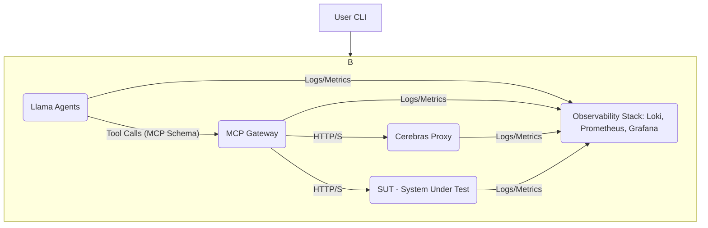
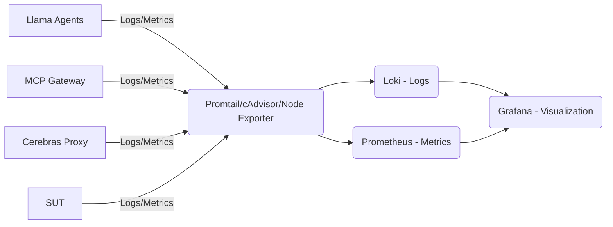

# Agentic Protocol Engine (APE)

The Agentic Protocol Engine (APE) is an open-source, AI-driven load testing tool designed to address the limitations of traditional load testing methods for complex, stateful cloud applications. Unlike conventional tools that rely on predefined, stateless scripts, APE simulates realistic, adaptive human user behavior across multi-step transactions using intelligent Large Language Model (LLM) agents.

## Why APE?

Modern microservices and cloud applications demand performance validation that mirrors real-world user interactions. Traditional load testing often falls short by:
*   **Failing to replicate stateful behavior:** Inability to maintain session context or adapt actions based on application feedback.
*   **Producing unrealistic traffic:** Static scripts cannot mimic the non-linear decision-making of human users.
*   **Missing critical insights:** Lack of dynamic error handling or contextual logging.

APE overcomes these challenges by deploying scalable, containerized LLM agents powered by high-speed inference endpoints. These agents execute dynamic, stateful decision-making in real-time, providing a far more realistic and insightful load profile.

## Features

*   **AI-Driven Stateful Simulation:** Agents maintain session context and adapt actions dynamically based on application responses, simulating complex user journeys (e.g., multi-step logins, purchases).
*   **High-Speed LLM Inference:** Leverages Cerebras llama3.1-8b for low cognitive latency, ensuring realistic Mean Time Between Actions (MTBA).
*   **Standardized Protocol Mediation:** Docker Model Context Protocol (MCP) Gateway standardizes communication between LLM agents and the System Under Test (SUT), enhancing configurability and security.
*   **Comprehensive Observability:** Integrated Loki, Prometheus, and Grafana stack for centralized logging, metrics, and real-time visualization of agent behavior and application performance.
*   **User-Friendly CLI:** A Node.js-based command-line interface for easy setup, execution, and scaling of load tests.
*   **Distributed Tracing:** Session/Trace ID injection for correlating agent decisions, MCP Gateway actions, and SUT responses across the entire transaction chain.

## Architecture Overview

APE employs a robust, logically segregated microservices architecture orchestrated by a user-friendly CLI tool and deployed with Docker Compose. It consists of three primary tiers: the Agent Layer, the Protocol Mediation Layer, and the Target Layer.



### Core Components

*   **Llama Agents:** Containerized instances of LLM agents (built with LlamaIndex) responsible for executing user goals and simulating stateful user sessions. They use specialized tools (`Tool_HTTP_GET`, `Tool_HTTP_POST`, `Tool_State_Update`) to interact with the environment and manage session context.
*   **Cerebras llama3.1-8b / Cerebras Proxy:** The high-speed inference engine providing the cognitive power for agent decision-making. The Cerebras Proxy acts as an internal service endpoint for communication with the actual Cerebras system.
*   **Docker MCP Gateway:** A critical central component that standardizes the communication format between the LLM Agents and external HTTP services (SUT and Cerebras endpoint). It acts as a decoupling layer, routing agent requests based on a defined schema.
*   **System Under Test (SUT):** The target cloud application or service being load tested.
*   **Observability Stack (Loki, Prometheus, Grafana):** A consolidated stack for centralized logging (Loki), metrics collection (Prometheus with cAdvisor/Node Exporter), and real-time visualization (Grafana dashboards).

## Observability Data Flow

The observability framework is crucial for validating the MVP, providing real-time insights into agent behavior, protocol mediation, and application impact.



*   **Collection:** Lightweight agents (Promtail, cAdvisor, Node Exporter) collect logs and metrics from all containerized services.
*   **Processing & Indexing:** Logs are streamed to Loki for fast indexing and searching, while metrics are collected by Prometheus.
*   **Visualization:** Grafana provides a "single pane of glass" for displaying real-time dashboards, correlating logs by Session/Trace ID, and visualizing key performance indicators.

## Key Performance Indicators (KPIs)

APE focuses on metrics that prove the superiority of AI simulation over traditional load tests:

*   **Cognitive and Cost Metrics (Agent Performance):**
    *   **End-to-End Latency:** Total time for a tool call (API request + LLM reasoning + execution).
    *   **Time-to-First-Token (TTFT):** Latency of the Cerebras inference endpoint, validating low cognitive latency.
    *   **Token Usage & Cost:** Tracks input/output tokens for operational costs and efficiency.
    *   **Tool Calls and Duration:** Frequency and duration of agent tool usage.
*   **Functional and Error Metrics (Realism):**
    *   **Successful Stateful Sessions (%):** Percentage of agents completing end-to-end multi-step journeys (Primary MVP success metric).
    *   **Error Rate (4xx, 5xx):** HTTP errors generated by the SUT.
    *   **Agent Traffic (Runs per Minute):** Total new sessions or model calls initiated.
*   **Infrastructure Metrics (Scalability):**
    *   **Concurrent Active Agents:** Live count of `llama_agent` containers.
    *   **CPU/Memory Utilization:** Resource consumption to identify bottlenecks.
    *   **Mean Time Between Actions (MTBA):** Validation of realism (must be < 1 second).

## Quick Start

### Prerequisites

- **Node.js 18+** - For running the CLI tool
- **Docker & Docker Compose** - For container orchestration
- **Cerebras API Key** - For LLM inference (sign up at [Cerebras Cloud](https://cloud.cerebras.ai/))

### Installation

Install APE globally using npm:

```bash
npm install -g agentic-protocol-engine
```

Or use npx for one-time setup:

```bash
npx create-ape-load my-load-test
```

### Basic Usage

1. **Create a new test project:**
   ```bash
   npx create-ape-load my-api-test
   cd my-api-test
   ```

2. **Configure your target application:**
   The setup wizard will prompt you for:
   - Target application URL
   - Authentication details
   - Test parameters (agent count, duration, goals)

3. **Start the load test:**
   ```bash
   ape-load start --agents 50 --duration 10
   ```

4. **Monitor in real-time:**
   ```bash
   # View live status
   ape-load status --watch
   
   # Follow logs
   ape-load logs --follow
   
   # Filter by trace ID
   ape-load logs --grep "trace-12345"
   ```

5. **Access Grafana dashboards:**
   Open http://localhost:3000 (admin/admin) to view real-time metrics and logs.

6. **Stop the test:**
   ```bash
   ape-load stop
   ```

## Configuration Examples

### REST API Testing

```json
{
  "target": {
    "name": "my-api",
    "baseUrl": "https://api.example.com",
    "authentication": {
      "type": "bearer",
      "loginEndpoint": "/auth/login",
      "credentials": {
        "username": "test-user",
        "password": "test-pass"
      }
    }
  },
  "agents": {
    "count": 100,
    "goals": [
      "Complete user registration flow",
      "Browse products and add to cart",
      "Complete checkout process"
    ]
  },
  "test": {
    "duration": "15m",
    "rampUp": "2m"
  }
}
```


      "loginMutation": "mutation Login($email: String!, $password: String!) { login(email: $email, password: $password) { token user { id name } } }"
    }
  },
  "agents": {
    "count": 50,
    "goals": [
      "Query user profile and update preferences",
      "Create and manage blog posts",
      "Interact with social features"
    ]
  }
}
```

## CLI Commands Reference

### `create-ape-load`

Create and configure a new APE load test environment.

```bash
npx create-ape-load [project-name] [options]
```

**Options:**
- `-t, --template <type>` - Template type: rest-api (default: rest-api)
- `-y, --yes` - Skip interactive prompts and use defaults
- `-o, --output <path>` - Output directory for generated files (default: .)

### `ape-load start`

Start load test with specified number of agents.

```bash
ape-load start [options]
```

**Options:**
- `-a, --agents <number>` - Number of concurrent agents (default: 10)
- `-c, --config <path>` - Path to configuration file (default: ./ape.config.json)
- `-d, --duration <minutes>` - Test duration in minutes (default: 5)

### `ape-load status`

Show current test status and metrics.

```bash
ape-load status [options]
```

**Options:**
- `-w, --watch` - Watch mode for real-time updates

### `ape-load logs`

View logs from running services.

```bash
ape-load logs [options]
```

**Options:**
- `-f, --follow` - Follow log output
- `-s, --service <name>` - Filter logs by service name
- `-g, --grep <pattern>` - Filter logs by pattern or trace ID
- `-t, --tail <lines>` - Number of lines to show from end (default: 100)

### `ape-load stop`

Stop running load test and cleanup resources.

```bash
ape-load stop [options]
```

**Options:**
- `-f, --force` - Force stop without graceful shutdown

## Monitoring and Observability

### Grafana Dashboards

APE includes pre-configured Grafana dashboards accessible at http://localhost:3000:

1. **APE Overview** - High-level metrics and system health
2. **Agent Performance** - Individual agent metrics and behavior
3. **Infrastructure** - Container and system resource usage
4. **Real-time Monitoring** - Live agent activity and success rates
5. **Trace Correlation** - Log correlation and debugging tools
6. **Critical Alerts** - Alert status and threshold monitoring

### Key Metrics to Monitor

- **Successful Stateful Sessions (%)** - Primary success indicator
- **Mean Time Between Actions (MTBA)** - Should be < 1 second
- **Time-to-First-Token (TTFT)** - LLM inference latency
- **Concurrent Active Agents** - Current load level
- **Error Rate Distribution** - 2xx/4xx/5xx response patterns
- **Resource Utilization** - CPU/Memory usage across containers

### Log Correlation

Use trace IDs to correlate events across the entire system:

```bash
# Find all events for a specific session
ape-load logs --grep "trace-abc123"

# Monitor specific agent behavior
ape-load logs --service llama-agent --grep "agent-001"
```

### Performance Optimization

#### Scaling Guidelines

- **Start small:** Begin with 10-50 agents and scale up gradually
- **Monitor resources:** Keep CPU usage below 80% and memory usage below 90%
- **Network capacity:** Ensure sufficient bandwidth for agent traffic
- **Target application:** Verify the SUT can handle the intended load

#### Resource Requirements

| Agent Count | Recommended CPU | Recommended RAM | Network |
|-------------|----------------|-----------------|---------|
| 1-50        | 4 cores        | 8 GB           | 100 Mbps |
| 51-200      | 8 cores        | 16 GB          | 500 Mbps |
| 201-500     | 16 cores       | 32 GB          | 1 Gbps  |
| 500+        | 32+ cores      | 64+ GB         | 10 Gbps |

## Acknowledgments

- **Cerebras Systems** - For providing high-speed LLM inference capabilities
- **LlamaIndex** - For the agent framework foundation
- **Docker** - For containerization and orchestration
- **Grafana Labs** - For the observability stack components
