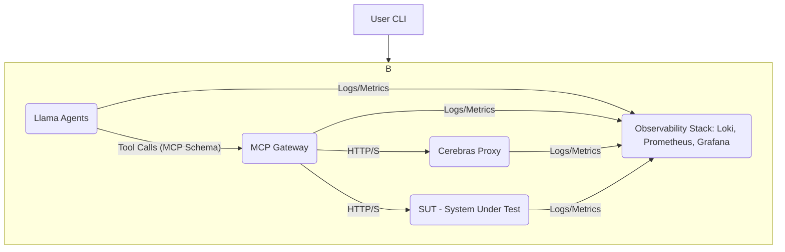
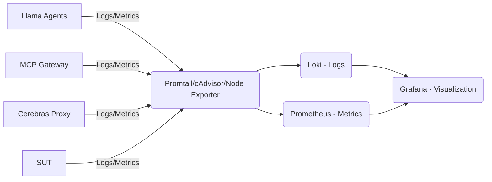

# Agentic Protocol Engine (APE)

The Agentic Protocol Engine (APE) is an open-source, AI-driven load testing tool designed to address the limitations of traditional load testing methods for complex, stateful cloud applications. Unlike conventional tools that rely on predefined, stateless scripts, APE simulates realistic, adaptive human user behavior across multi-step transactions using intelligent Large Language Model (LLM) agents.

## Why APE?

Modern microservices and cloud applications demand performance validation that mirrors real-world user interactions. Traditional load testing often falls short by:
*   **Failing to replicate stateful behavior:** Inability to maintain session context or adapt actions based on application feedback.
*   **Producing unrealistic traffic:** Static scripts cannot mimic the non-linear decision-making of human users.
*   **Missing critical insights:** Lack of dynamic error handling or contextual logging.

APE overcomes these challenges by deploying scalable, containerized LLM agents powered by high-speed inference endpoints. These agents execute dynamic, stateful decision-making in real-time, providing a far more realistic and insightful load profile.

## Features

*   **AI-Driven Stateful Simulation:** Agents maintain session context and adapt actions dynamically based on application responses, simulating complex user journeys (e.g., multi-step logins, purchases).
*   **High-Speed LLM Inference:** Leverages Cerebras Llama 4 Scout for low cognitive latency, ensuring realistic Mean Time Between Actions (MTBA).
*   **Standardized Protocol Mediation:** Docker Model Context Protocol (MCP) Gateway standardizes communication between LLM agents and the System Under Test (SUT), enhancing configurability and security.
*   **Comprehensive Observability:** Integrated Loki, Prometheus, and Grafana stack for centralized logging, metrics, and real-time visualization of agent behavior and application performance.
*   **User-Friendly CLI:** A Node.js-based command-line interface for easy setup, execution, and scaling of load tests.
*   **Distributed Tracing:** Session/Trace ID injection for correlating agent decisions, MCP Gateway actions, and SUT responses across the entire transaction chain.

## Architecture Overview

APE employs a robust, logically segregated microservices architecture orchestrated by a user-friendly CLI tool and deployed with Docker Compose. It consists of three primary tiers: the Agent Layer, the Protocol Mediation Layer, and the Target Layer.

### Core Components

*   **Llama Agents:** Containerized instances of LLM agents (built with LlamaIndex) responsible for executing user goals and simulating stateful user sessions. They use specialized tools (`Tool_HTTP_GET`, `Tool_HTTP_POST`, `Tool_State_Update`) to interact with the environment and manage session context.
*   **Cerebras Llama 4 Scout / Cerebras Proxy:** The high-speed inference engine providing the cognitive power for agent decision-making. The Cerebras Proxy acts as an internal service endpoint for communication with the actual Cerebras system.
*   **Docker MCP Gateway:** A critical central component that standardizes the communication format between the LLM Agents and external HTTP services (SUT and Cerebras endpoint). It acts as a decoupling layer, routing agent requests based on a defined schema.
*   **System Under Test (SUT):** The target cloud application or service being load tested.
*   **Observability Stack (Loki, Prometheus, Grafana):** A consolidated stack for centralized logging (Loki), metrics collection (Prometheus with cAdvisor/Node Exporter), and real-time visualization (Grafana dashboards).

## Observability Data Flow

The observability framework is crucial for validating the MVP, providing real-time insights into agent behavior, protocol mediation, and application impact.

*   **Collection:** Lightweight agents (Promtail, cAdvisor, Node Exporter) collect logs and metrics from all containerized services.
*   **Processing & Indexing:** Logs are streamed to Loki for fast indexing and searching, while metrics are collected by Prometheus.
*   **Visualization:** Grafana provides a "single pane of glass" for displaying real-time dashboards, correlating logs by Session/Trace ID, and visualizing key performance indicators.

## Key Performance Indicators (KPIs)

APE focuses on metrics that prove the superiority of AI simulation over traditional load tests:

*   **Cognitive and Cost Metrics (Agent Performance):**
    *   **End-to-End Latency:** Total time for a tool call (API request + LLM reasoning + execution).
    *   **Time-to-First-Token (TTFT):** Latency of the Cerebras inference endpoint, validating low cognitive latency.
    *   **Token Usage & Cost:** Tracks input/output tokens for operational costs and efficiency.
    *   **Tool Calls and Duration:** Frequency and duration of agent tool usage.
*   **Functional and Error Metrics (Realism):**
    *   **Successful Stateful Sessions (%):** Percentage of agents completing end-to-end multi-step journeys (Primary MVP success metric).
    *   **Error Rate (4xx, 5xx):** HTTP errors generated by the SUT.
    *   **Agent Traffic (Runs per Minute):** Total new sessions or model calls initiated.
*   **Infrastructure Metrics (Scalability):**
    *   **Concurrent Active Agents:** Live count of `llama_agent` containers.
    *   **CPU/Memory Utilization:** Resource consumption to identify bottlenecks.
    *   **Mean Time Between Actions (MTBA):** Validation of realism (must be < 1 second).
