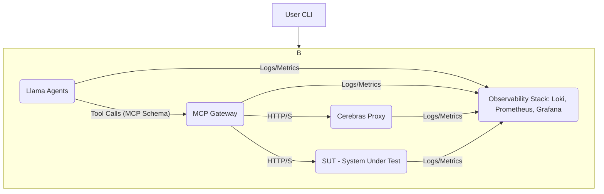

# Agentic Protocol Engine (APE)

The Agentic Protocol Engine (APE) is an open-source, AI-driven load testing tool designed to address the limitations of traditional load testing methods for complex, stateful cloud applications. Unlike conventional tools that rely on predefined, stateless scripts, APE simulates realistic, adaptive human user behavior across multi-step transactions using intelligent Large Language Model (LLM) agents.

## Why APE?

Modern microservices and cloud applications demand performance validation that mirrors real-world user interactions. Traditional load testing often falls short by:
*   **Failing to replicate stateful behavior:** Inability to maintain session context or adapt actions based on application feedback.
*   **Producing unrealistic traffic:** Static scripts cannot mimic the non-linear decision-making of human users.
*   **Missing critical insights:** Lack of dynamic error handling or contextual logging.

APE overcomes these challenges by deploying scalable, containerized LLM agents powered by high-speed inference endpoints. These agents execute dynamic, stateful decision-making in real-time, providing a far more realistic and insightful load profile.

## Features

*   **AI-Driven Stateful Simulation:** Agents maintain session context and adapt actions dynamically based on application responses, simulating complex user journeys (e.g., multi-step logins, purchases).
*   **High-Speed LLM Inference:** Leverages Cerebras llama3.1-8b for low cognitive latency, ensuring realistic Mean Time Between Actions (MTBA).
*   **Standardized Protocol Mediation:** Docker Model Context Protocol (MCP) Gateway standardizes communication between LLM agents and the System Under Test (SUT), enhancing configurability and security.
*   **Comprehensive Observability:** Integrated Loki, Prometheus, and Grafana stack for centralized logging, metrics, and real-time visualization of agent behavior and application performance.
*   **User-Friendly CLI:** A Node.js-based command-line interface for easy setup, execution, and scaling of load tests.
*   **Distributed Tracing:** Session/Trace ID injection for correlating agent decisions, MCP Gateway actions, and SUT responses across the entire transaction chain.

## Architecture Overview

APE employs a robust, logically segregated microservices architecture orchestrated by a user-friendly CLI tool and deployed with Docker Compose. It consists of three primary tiers: the Agent Layer, the Protocol Mediation Layer, and the Target Layer.

For a more detailed explanation of the architecture and design decisions, please refer to the [APE Technical Design](APE_Technical_Design.md).



### Core Components

*   **Llama Agents:** Containerized instances of LLM agents (built with LlamaIndex) responsible for executing user goals and simulating stateful user sessions. They use specialized tools (`Tool_HTTP_GET`, `Tool_HTTP_POST`, `Tool_State_Update`) to interact with the environment and manage session context.
*   **Cerebras llama3.1-8b / Cerebras Proxy:** The high-speed inference engine providing the cognitive power for agent decision-making. The Cerebras Proxy acts as an internal service endpoint for communication with the actual Cerebras system.
*   **Docker MCP Gateway:** A critical central component that standardizes the communication format between the LLM Agents and external HTTP services (SUT and Cerebras endpoint). It acts as a decoupling layer, routing agent requests based on a defined schema.
*   **System Under Test (SUT):** The target cloud application or service being load tested.

## Quick Start

### Prerequisites

- **Node.js 18+** - For running the CLI tool
- **Docker & Docker Compose** - For container orchestration
- **Cerebras API Key** - For LLM inference (sign up at [Cerebras Cloud](https://cloud.cerebras.ai/))

### Installation

Install APE globally using npm:

```bash
npm install -g agentic-protocol-engine
```

Or use npx for one-time setup:

```bash
npx create-ape-load my-load-test
```

### Basic Usage

1. **Create a new test project:**
   ```bash
   npx create-ape-load my-api-test
   cd my-api-test
   ```

2. **Configure your target application:**
   The setup wizard will prompt you for:
   - Target application URL
   - API key
   - API Specification file
   - Test parameters (agent count, duration, goals)

3. **Start the load test:**
   ```bash
   ape-load start
   ```

4s. **Stop the test:**
   ```bash
   ape-load stop
   ```

## CLI Commands Reference

### `create-ape-load`

Create and configure a new APE load test environment.

```bash
npx create-ape-load [project-name]
```

### `ape-load start`

Start load test with specified number of agents.

```bash
ape-load start 
```

### `ape-load status`

Show current test status and metrics.

```bash
ape-load status
```

### `ape-load logs`

View logs from running services.

```bash
ape-load logs [option]
```

**Option:**
- `-s, --service <name>` - Filter logs by service name

### `ape-load stop`

Stop running load test and cleanup resources.

```bash
ape-load stop 
```

## Acknowledgments

- **Cerebras Systems** - For providing high-speed LLM inference capabilities
- **LlamaIndex** - For the agent framework foundation
- **Docker** - For containerization and orchestration
